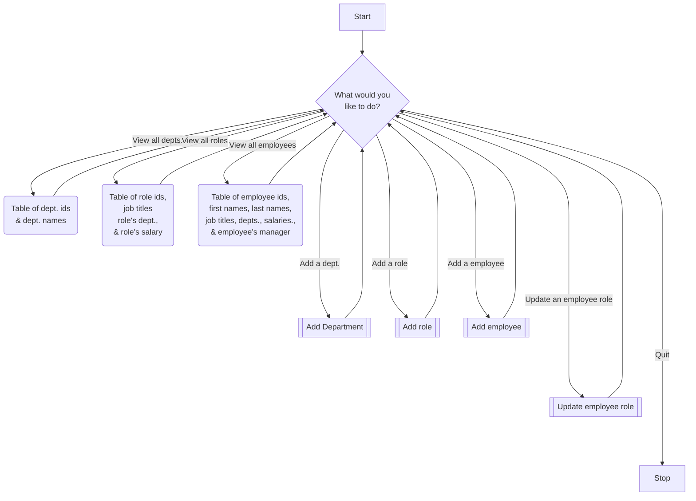
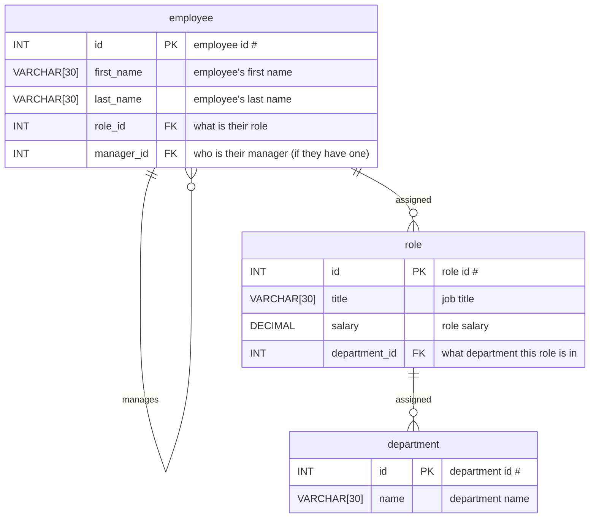

# employee-tracker

Homework Challenge 12, Due January 12

## About this Challenge

Developers frequently have to create interfaces that allow non-developers to easily view and interact with information stored in databases. These interfaces are **called content management systems** (CMS). Your assignment this week is to build a command-line application from scratch to manage a company's employee database, using Node.js, Inquirer, and MySQL.

> In order to install `inquirer`, please use npm i `inquirer@8.2.4`.

Because this application won’t be deployed, you’ll also need to create a walkthrough video that demonstrates its functionality and all of the following acceptance criteria being met. You’ll need to submit a link to the video and add it to the README of your project.

## User Story

```text
AS A business owner
I WANT to be able to view and manage the departments, roles, and employees in my company
SO THAT I can organize and plan my business
```

## Acceptable Criteria

```text
GIVEN a command-line application that accepts user input
WHEN I start the application
THEN I am presented with the following options: view all departments, view all roles, view all employees, add a department, add a role, add an employee, and update an employee role
WHEN I choose to view all departments
THEN I am presented with a formatted table showing department names and department ids
WHEN I choose to view all roles
THEN I am presented with the job title, role id, the department that role belongs to, and the salary for that role
WHEN I choose to view all employees
THEN I am presented with a formatted table showing employee data, including employee ids, first names, last names, job titles, departments, salaries, and managers that the employees report to
WHEN I choose to add a department
THEN I am prompted to enter the name of the department and that department is added to the database
WHEN I choose to add a role
THEN I am prompted to enter the name, salary, and department for the role and that role is added to the database
WHEN I choose to add an employee
THEN I am prompted to enter the employee’s first name, last name, role, and manager, and that employee is added to the database
WHEN I choose to update an employee role
THEN I am prompted to select an employee to update and their new role and this information is updated in the database
```

## Todo List

- [ ] Create a command-line application
  - [ ] Main menu has the following options: "view all departments", "view all roles", "view all employees", "add a department", "add a role", "add an employee", and "update an employee role"
  - [ ] When "view all departments" is chosen, display all the departments ids and names
    - Note: A view query was defined to view all departments.
  - [ ] When "view all roles" is chosen, display the role id, job title, salary, and department (via department table)
    - Note: A view query was defined to view all roles as well as a view query to view all roles with the department names.
  - [ ] When "view all employees" is chosen, display all the employees' ids, first and last names, roles, and managers
    - Note: a view query was defined to view all employees as well as viewing all employees, as well as a view query to view all employees with managers and a view query to view all employees by salary 
  - [ ] When "add a department" is chosen, I am prompted to enter the name of the department to the database. This information will be added to the `department` table.
  - [ ] When "add a role" is chosen, I am prompted to enter the name of the job title, salary, and department it belongs to. This information will be added to the `role` table.
  - [ ] When "add an employee" is chosen, I am prompted to enter the employee's first name, last name, role, and manager. This information will be added to the `employee` table.
  - [ ] When "update an employee role" is chosen, I am prompted to select an employee to update and their new role. The update will be applied to the `employee` table.
  - [ ] BONUS: When "update employee managers" is chosen, I am prompted to select and employee and update their manager. The update will be applied to the `employee` table.
    - In retrospect, it probably would have made more sense to assign an employee who is the manger to a department such that rather than update the manager for each employee, the manager could be changed and all of their underlings would reflect that. Maybe a discussion on this would in order.
  - [ ] BONUS: When "view employees by manager" is chosen, I am prompted for the name of a manager in the `employee`'s table and I will see a list of employee's that they manage.
  - [ ] BONUS: When "view employees by department" is chosen, I am prompted for the name of a department, which the key that is used in `department` will be used to filter the list of roles in the `roles` table and employees in the `employee` table.
  - [ ] BONUS: Delete a department(s): When I delete a department, the department is removed. The roles in that department might be orphaned?
  - [ ] BONUS: Delete a role(s): When I delete a role, the employees that had that role should not have that role any more.
  - [ ] BONUS: Delete an employee(s): When I delete an employee, the employee is removed from the `employee` table.
  - [ ] BONUS: View the total utilized budget of a department--in other words, the combined salaries of all employees in that department: Get a list of all the departments, get a list of roles in that department, find how many employees have that role and multiply that by how much the role pays, then sum up each of the roles to get how much money is spent for all the employees in that department. Repeat for all the departments. (If this was Excel, I probably would have used a `SUMPRODUCT` function and probably ended this with a total of everything...and their'd probably be a few pie charts and bar charts.)
- [ ] Walkthrough video
- [ ] Technical
  - [ ] Uses `inquirer` package.
  - [ ] Uses `mysql2` package.
    - Because MySQL has become "persona non grata" since Oracle bought Sun Microsystems, a lot of open source database users have migrated to other databases such as MariaDB.  For that reason, I will need to use the `mariadb` package as well as `mysql2`.
    - Consider making queries asynchronous. The `mysql2` package exposes a `.promises()` function on Connections to upgrade an existing non-Promise connection to use Promises. (If I recall correctly, there's a function called `.promisify()` that fixes that.)
  - [ ] Uses `console.table`.
    - Don't know why they call this a "package". `console.table` is built-in.
  - [ ] Follows the table schema outlined in the homework instructions.

## Notes

> I might borrow some of the resources from Module 10 (Team Profile Generator)

So to fulfill the first WHEN-THEN statement, inquirer will need to have a menu that look something like this

```text
What would you like to do?
- View All Departments
- View All Roles
- View All Employees
- Add a Department
- Add a Role
- Add an Employee
- Update an Employee Role
- Quit
```

Those last two items, look like things that can be borrowed from HW10.



As you can see in this flowchart, our menu is quite dense.  It may be necessary to add other menus to group our tasks into separate menus.  What's more, I can't help but notice that we have our Create, Read, and Update tasks, but there is no Delete task to make this a full CRUD application. We'll worry about adding additional functionality later.

Let's take into account the Entity-Relationship Diagram (a.k.a. ER Diagram or ER Model)

> Note: I had to use square brackets to denote `VARCHAR` size because mermaid would not accept parethesis.
> Also, the bonuses are not mapped out in these diagrams.



I took some extra steps to make use of the `VIEW`s and `PROCEDURE`s